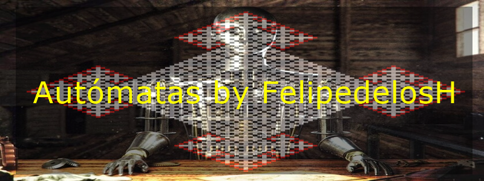

<h1 align="center"> FelipedelosH </h1>
 
<h4>Automaton</h4>

 
:construction: IN CONSTRUCTION :construction:
  

## Automata Theory

This repository contains learning materials and code implementations for various automata types and formal language concepts. It serves as a personal study guide and codebase for exploring theoretical computer science fundamentals.

## Purpose

- Learn and implement different types of automata (DFA, NFA, Turing Machines, etc.)
- Understand formal languages and the Chomsky hierarchy
- Practice with automata operations and transformations
- Build foundational knowledge for developing intelligent systems, NPCs, and chatbots

The repository includes theoretical notes in PDF format and Python implementations of automata concepts.

## :hammer:Funtions:

- `Function 1`: Neque porro quisquam est qui dolorem ipsum quia dolor sit amet. 
- `Function 2`: Neque porro quisquam est qui dolorem ipsum quia dolor sit amet. 
- `Function 3`: Neque porro quisquam est qui dolorem ipsum quia dolor sit amet. 
- `Function 3a`: Neque porro quisquam est qui dolorem ipsum quia dolor sit amet. 
- `Function 4`: Neque porro quisquam est qui dolorem ipsum quia dolor sit amet. 

## :play_or_pause_button:How to execute a project

Double click

## :hammer_and_wrench:Tech.

- Python.
- 

## :warning:Warning.

- limitations.

## Autor

| [ Andrés Felipe Hernánez](https://github.com/felipedelosh)|
| :---: |